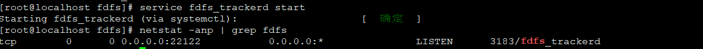
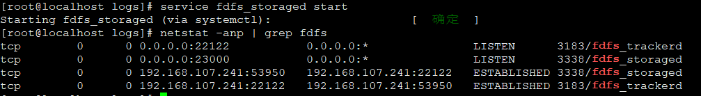

## 单机环境部署

### 安装必要的工具

```bash
yum install wget
yum install gcc gcc-c++
yum install perl
yum install unzip

# nginx 需要的包
yum install -y pcre pcre-devel
yum install -y zlib zlib-devel
```


### 下载安装libfastcommon和FastDFS

```bash
mkdir /data && cd /data

wget https://github.com/happyfish100/fastdfs/archive/V5.11.tar.gz
wget https://github.com/happyfish100/libfastcommon/archive/V1.0.36.tar.gz
```

安装libfastcommon

```bash
tar -zxvf V1.0.36.tar.gz
cd libfastcommon-1.0.36
./make.sh 
./make.sh install
```

安装fastdfs

```bash
cd /data
tar -zxvf V5.11.tar.gz && cd fastdfs-5.11
./make.sh && .make.sh install
```


### 配置Tracker服务器

在`/etc/fdfs`路径下找到tracker.conf.sample, 复制该文件

```bash
cp tracker.conf.sample tracker.conf
```

然后修改*tracker.conf*文件中的base_path和http.server两个参数

其中, base_path中的路径需要在启动前创建

```xml
base_path=/data/fastdfs
http.server_port=80
```

配置修改完成之后可以使用下边的命令启动Tracker服务

```bash
/usr/bin/fdfs_trackerd /etc/fdfs/tracker.conf start/stop/restart
```

或者

```bash
service fdfs_trackerd start/stop/restart
```

启动完成之后如果没有报错可以查看下端口监听来判断Tracker服务是否正确启动

```bash
netstat -unltp | grep fdfs
```

### 配置Storage服务器

同样在`/etc/fdfs`路径下找到storage.conf.sample文件, 复制该文件

```bash
cd /etc/fdfs
cp storage.conf.sample storage.conf
vi storage.conf
```

修改base_path store_path0和tracker_server三个配置, 其中路径需要提前建好

```xml
base_path=/data/fastdfs/storage
store_path0=/data/fastdfs/storage
tracker_server=192.168.107.241:22122
```

修改配置完成后用如下命令启动Storage服务器

```bash
/usr/bin/fdfs_storaged /etc/fdfs/storage.conf
# 或者
service fdfs_storaged start
```

启动完成之后依然使用

```bash
netstat -antlp | grep fdfs
```

来查看storage服务器是否启动成功.

### 配置Nginx 及Nginx插件

可以使用fdfs_monitor检查fdfs的服务是否配置成功

```bash
service fdfs_trackerd start
service fdfs_storaged start
fdfs_monitor /etc/storage.conf
# 或者
fdfs_monitor /etc/client.conf
```


###  配置Nginx 及Nginx插件

1. 下载nginx和插件fastdfs-nginx-module模块

```bash
wget -c https://nginx.org/download/nginx-1.10.1.tar.gz 
wget https://github.com/happyfish100/fastdfs-nginx-module/archive/master.zip
```

2. 解压安装包,  其中zip文件需要安装unzip工具来解压

```bash
unzip master.zip
tar -zxvf nginx-1.10.1.tar.gz
```

3. 安装nginx及其插件

```bash
cd nginx-1.10.1
./configure --add-module=../fastdfs-nginx-module-master/src
make && make install
```

4. 配置nginx插件 fastdfs-nginx-module


```bash
cd fastdfs-nginx-module/src
cp mod_fastdfs.conf /etc/fdfs
vi /etc/fdfs/mod_fastdfs.conf
```

修改tracker_server  url_have_group_name和store_path0三个参数

```xml
tracker_server=192.168.107.241:22122
url_have_group_name=true
store_path0=/data/fastdfs/storage
```

然后从fastdfs的安装包路径下copy三个文件到/etc/fdfs

```bash
cd /data/fastdfs-5.11/conf
cp anti-steal.jpg /etc/fdfs
cp http.conf /etc/fdfs
cp mime.types /etc/fdfs
```


5. 配置nginx

在`nginx.conf`加入

```bash
cd /usr/local/nginx/conf
vim nginx.conf
```

```xml
location /group1/M00 { 
    root /data/fastdfs/storage/; 
    ngx_fastdfs_module; 
}
```

因为配置了group1/M00的访问, 所以需要建立一个group1文件夹, 并建立M00到data的软连接

```bash
mkdir /data/fastdfs/storage/data/group1
ln -s /data/fastdfs/storage/data/ /data/fastdfs/storage/data/group1/M00

```

启动nginx

```bash
/usr/local/nginx/sbin/nginx
/usr/local/nginx/sbin/nginx -s reload     # 重启nginx
```

### 上传文件测试

1. 启动Tracker和Storage服务器

```bash
service fdfs_trackerd start
service fdfs_storaged start
```

2. 启动nginx

```bash
# 启动nginx
/usr/local/nginx/sbin/nginx
# 重启nginx
/usr/local/nginx/sbin/nginx -s reload
# nginx端口默认80, 查看命令
netstat -anp | grep 80

# 添加放开端口设置
firewall-cmd --permanent --zone=public --add-port=80/tcp
systemctl restart firewalld
```

3. 配置client.conf

```bash
cd /etc/fdfs/
cp client.conf.sample client.conf
vi client.conf
```

修改base_path和tracker_server的两个配置

```xml
base_path=/data/fastdfs/
tracker_server=192.168.107.241:22122
```

4. 上传文件

```bash
fdfs_test /etc/fdfs/client.conf upload filename
```

上传成功后会返回一个文件的路径.

## 集群环境部署

### 安装FastDFS(全部)

分别安装libfastcommon-1.0.36和fastdfs-5.11

```bash
cd libfastcommon-1.0.36
./make && ./make install
cd ../fastdfs-5.11
./make && ./make install
```

### 配置tracker

```bash
cd /etc/fdfs
cp tracker.conf.sample tracker.conf
```

修改tracker.conf中的两个配置, 其中base_path必须在启动tracker之前创建好文件路径

```config
base_path=/data/fastdfs/tracker
http.server_port=80
```

修改完成之后可以测试下tracker

```bash
service fdfs_trackerd start
netstat -anp | grep fdfs
```

如果结果是

则表示tracker已经启动成功.

也可以查看tracker日志看看tracker是否已经启动成功

```bash
vi /data/fastdfs/tracker/logs/trackerd.log
```


### 配置Storage

修改base_path store_path0和tracker_server三个配置, 其中路径需要提前建好

```xml
base_path=/data/fastdfs/storage
store_path0=/data/fastdfs/storage
tracker_server=192.168.107.241:22122
```

修改配置完成后用如下命令启动Storage服务器

```bash
/usr/bin/fdfs_storaged /etc/fdfs/storage.conf
# 或者
service fdfs_storaged start
```

启动完成之后依然使用

```bash
netstat -antlp | grep fdfs
```

来查看storage服务器是否启动成功.

如图  表示启动成功. 

### 在storage上配置nginx

fastdfs-nginx-module模块只需要安装在storage上.

#### 安装nginx

```bash
./configure --add-module=../fastdfs-nginx-module-master/src/ --prefix=/usr/local/nginx
make && make install

```

#### 配置fastdfs-nginx-module

```bash
cd /data/fastdfs-nginx-module-master/src
cp mod_fastdfs.conf /etc/fdfs
vi mod_fastdfs.conf
```

修改mod_fastdfs.conf中的一下几个参数

```config
base_path=/root/fastdfs           #保存日志目录
tracker_server=192.168.53.85:22122
tracker_server=192.168.53.86:22122 
storage_server_port=23000         #storage服务器的端口号
group_name=group1                 #当前服务器的group名
url_have_group_name = true        #文件url中是否有group名
store_path_count=1                #存储路径个数，需要和store_path个数匹配
store_path0=/root/fastdfs         #存储路径
group_count = 2 
```

在mod_fastdfs.conf文件末尾增加组的具体信息:

```config
[group1]
group_name=group1
storage_server_port=23000
store_path_count=1
store_path0=/root/fastdfs

[group2]
group_name=group2
storage_server_port=23000
store_path_count=1
store_path0=/root/fastdfs
```

#### 建立M00到存储目录的符号链接

```bash
ln -s /data/fastdfs/storage/data /data/fastdfs/storage/data/M00
ll /data/fastdfs/storage/data/M00
```

#### 配置nginx

```bash
vi /usr/local/nginx/conf/nginx.conf
```

修改nginx.conf在server中添加

```bash
location ~/group[1-2]/M00 {
    root /root/fastdfs/data;
    ngx_fastdfs_module;
}
```

#### 复制fastdfs中的http.conf, mime.types文件到/etc/fdfs

```bash
cd /data/fastdfs-5.11

cp http.conf /etc/fdfs
cp mime.types /etc/fdfs
cp anti-steal.jpg /etc/fdfs
```


### 在tracker上配置nginx

在tracker上安装的nginx主要是为了提供http访问的反向代理, 负载均衡以及缓存服务.

```bash
cd /data/nginx-1.10.1
# 设置安装路径
./configure --prefix=/usr/local/nginx

make && make install 
```

修改nginx.conf的配置

```bash
http {
    #设置group1的服务器
    upstream fdfs_group1 {
        server 192.168.53.90:8080 weight=1 max_fails=2 fail_timeout=30s;
        server 192.168.54.229:8080 weight=1 max_fails=2 fail_timeout=30s;
    }
    #设置group2的服务器
    upstream fdfs_group2 {
        server 192.168.54.233:8080 weight=1 max_fails=2 fail_timeout=30s;
        server 192.168.54.234:8080 weight=1 max_fails=2 fail_timeout=30s;
    }

   server {
       #设置服务器端口
        listen       8080;
       #设置group1的负载均衡参数
        location /group1/M00 {
            proxy_pass http://fdfs_group1;
        }
        #设置group2的负载均衡参数
        location /group2/M00 {
            proxy_pass http://fdfs_group2;
        }
      }

    }
```

至此nginx设置完成

### 上传文件测试

#### 启动tracker storage nginx

```bash
/usr/local/nginx/sbin/nginx
service fdfs_trackerd start
service fdfs_storaged start
```

#### 修改client.conf

```bash
cd /etc/fdfs
cp client.conf.sample client.conf
vi client.conf
```

修改以下参数

```bash
base_path=/data/fastdfs/
tracker_server=192.168.107.241:22122
http.tracker_server_port=80
```

#### 上传文件

```bash
fdfs_test /etc/fdfs/client.conf upload filename
# 或者
/usr/bin/fdfs_upload_file /etc/fdfs/client.conf t.jpg 
```


## firewall-cmd放开端口

```bash
# 查看防火墙的状态
systemctl status firewalld
# 关闭防火墙
systemctl stop firewalld
# 安装firewalld
yum install firewalld
```

### firewall-cmd 添加端口过滤

```bash
# 1. 添加放开端口的规则
firewall-cmd --permanent --zone=public --add-port=80/tcp
# 2. 重启firewalld使规则生效
systemctl restart firewalld
# 3. 检查更改是否生效
firewall-cmd --zone=public --query-port=80/tcp
```


