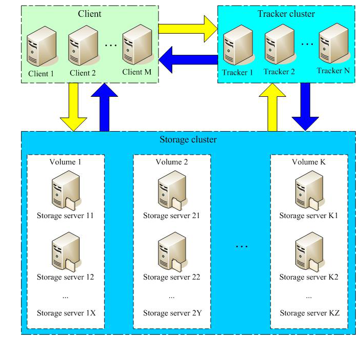

## FastDFS简介
FastDFS是一个开源的轻量级分布式文件系统, 作者余庆(happyfish100), 用C语言实现, 解决了大数据存储和读写负载均衡等问题. 由跟踪服务器, 存储服务器和客户端三个部分组成. 主要解决了海量数据存储问题, 特别适合存储中小文件([4kb, 500M])为载体的在线服务.

下图是FastDFS的架构图.

### Storage Server

存储服务器,  以组(卷, group或volume)为单位组织, 一个group内可以包含多台storage机器, 数据互为备份. 当存储空间不足或即将耗尽的时候, 可以动态添加卷. 只需要增加一台或多台服务器, 并将它们配置为一个新的卷, 这样就扩大了存储系统的容量.

### Tracker Server

跟踪服务器, 是FastDFS的协调者, 主要做调度工作, 负责管理所有的storage server和group. 每个Storage Server在启动后会链接Tracker Server, 告知自己所属的group的信息, 并保持周期性心跳.

架构的优点:

* 高可靠性, 无单点故障
* 高吞吐性, 只要group足够多, 数据流量将足够分散

FastDFS向使用者提供基本的文件访问接口, upload, download等.

上传的流程主要是客户端发送上传请求到Tracker Server, Tracker Server根据一定规则分配group和Storage Server. 分配好Storage Server之后, 客户端回想Storage Server发送写文件请求, 而Storage Server会为文件分配一个数据存储目录, 选定存储目录之后, Storage Server会为文件生成一个Fieldid, 由Storage Server iP, 文件创建时间, 文件大小, 文件CRC32和一个随机数拼接而成, Storage Server会根据文件的fieldid进行两次hash, 路由到其中一个子目录, 然后将文件存储到该子目录下, 最后生成文件路径: group名称, 虚拟磁盘路径, 数据两级目录, fieldid和文件后缀.

上传流程图

我主要了解了上传的功能, 其他的下载,同步等可以参考 [分布式文件系统FastDFS设计原理](http://blog.chinaunix.net/uid-20196318-id-4058561.html).

