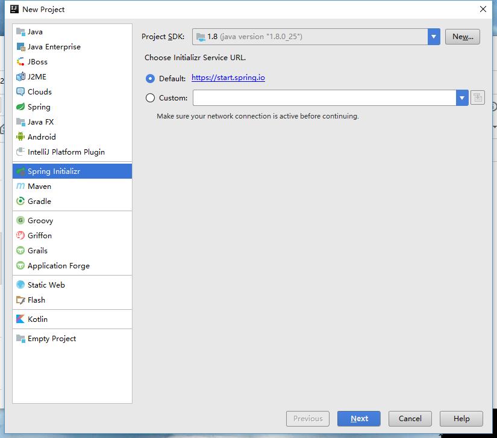
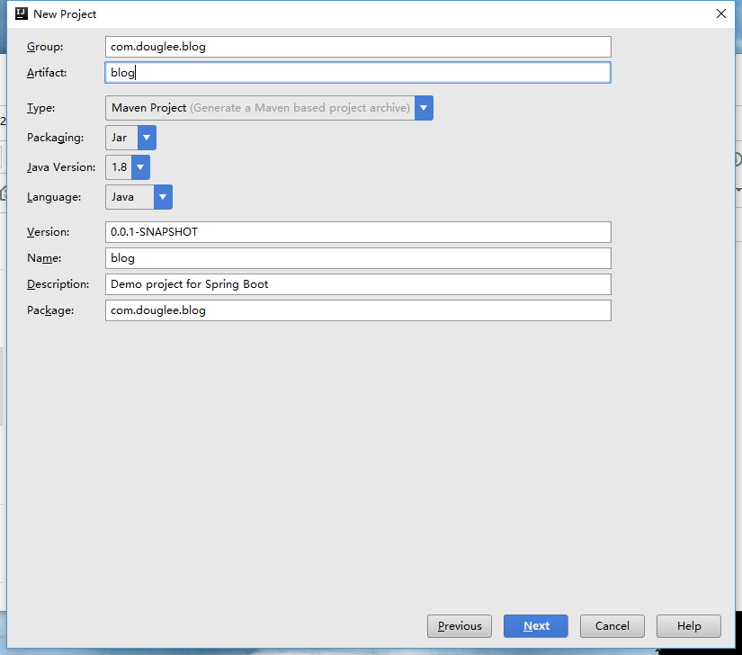
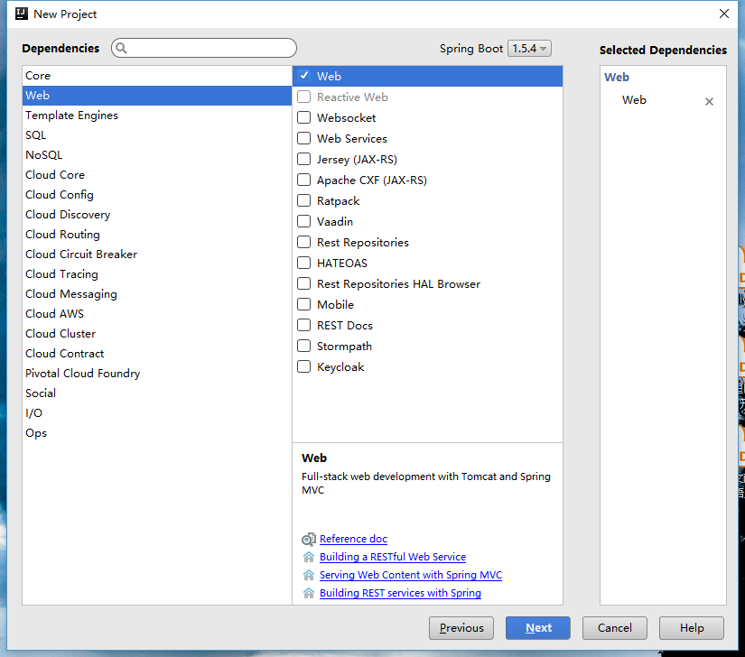
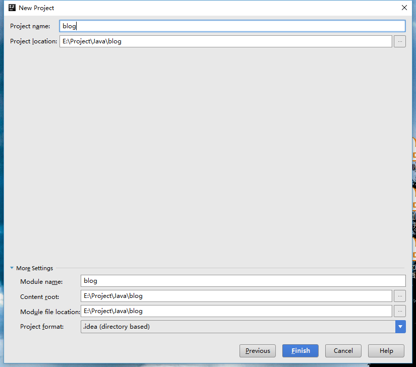
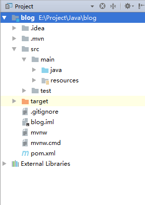

项目用到的环境:

+ Windows 10
+ JDK8
+ IntelliJ IDEA 2017.1.3
+ Apache Tomcat 8
+ Maven 3.3.3

## 使用IDEA新建spring boot项目

### 新建项目
选择类型为Spring Initializer.



### 填入相关的项目信息



### 选择denpendcy

接着下一步, 选择web.



### 选择路径
再下一步, 选择项目的路径, 点击完成



新建成的项目的文件目录结构如下图:




## 第一个Spring boot项目

pom.xml如下所示:

```xml
    <dependencies>
        <dependency>
            <groupId>org.springframework.boot</groupId>
            <artifactId>spring-boot-starter-web</artifactId>
        </dependency>

        <dependency>
            <groupId>org.springframework.boot</groupId>
            <artifactId>spring-boot-starter-test</artifactId>
            <scope>test</scope>
        </dependency>
    </dependencies>
```

其中, spring-boot-starter-web是支持web的模块, spring-boot-starter-test是支持测试的模块.

添加一个HelloWorldController如下:

```java
import org.springframework.web.bind.annotation.RequestMapping;
import org.springframework.web.bind.annotation.RestController;


@RestController
public class HelloWorldController {

    @RequestMapping("/")
    public String index(){
        return "Hello World";
    }
}
```

@RestController表示里边的方法都以json格式输出, 无需再添加额外的json配置.

### 启动程序

点击Shift + F10 或者直接点击运行, 待项目启动成功后, 访问http://localhost:8080


如图即表示第一个spring boot项目启动成功.
