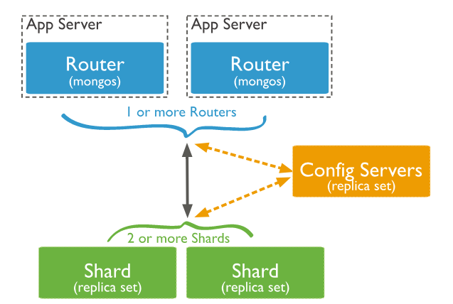

# Mongodb3.6 集群搭建

三种方式: Replica Set / Sharding / Master-Slave




四个组件:

* mongos
* config server
* shard
* replica set


mongodb配置模板

```
systemLog:
  destination: file
  logAppend: true
  logRotate: rename
  path: $mymongo/logs/mongod.log
  timeStampFormat: iso8601-local
  traceAllExceptions: false
  verbosity: 0
processManagement:
  fork: true
  pidFilePath: $mymongo/logs/mongod.pid
net:    
  #bindIp: 127.0.0.1
  port: 3001
  http:
    enabled: false
  maxIncomingConnections: 1000
  unixDomainSocket:
    enabled: false
operationProfiling:
  mode: slowOp
  slowOpThresholdMs: 100    
security:
  authorization: enabled
  keyFile: $mymongo/etc/keyfile
  javascriptEnabled: false
replication:
  oplogSizeMB: 5120
  replSetName: myreplset
storage:
  dbPath: $mymongo/data
  directoryPerDB: true
  syncPeriodSecs: 60
  engine: wiredTiger
  journal:
    enabled: true
    commitIntervalMs: 100
  wiredTiger:
    engineConfig:
      cacheSizeGB: 4
```


## 1. 安装mongodb

## 2. 配置config server

配置文件 21000

启动

连接客户端

```bash
config = {
    _id: "configs",
    members: [
        {_id: 0, host: "192.168.107.242:21000"},
        {_id: 1, host: "192.168.107.242:31000"},
        {_id: 2, host: "192.168.107.242:41000"},
    ]
}
rs.initiate(config)
rs.status()
```

###

## 3. 设置分片副本集

shard1 27001

配置文件

启动

执行:

```bash
use admin
config={
    _id: "shard1",
    members: [
        {_id: 0, host: "192.168.107.242:27001"},
        {_id: 1, host: "192.168.107.242:37001"},
        {_id: 2, host: "192.168.107.242:47001", arbiterOnly: true},
    ]
}
rs.initiate(config)
rs.status()
```


shard2  27002

```bash
use admin
config={
    _id: "shard2",
    members: [
        {_id: 0, host: "192.168.107.242:27002", arbiterOnly: true},
        {_id: 1, host: "192.168.107.242:37002"},
        {_id: 2, host: "192.168.107.242:47002"},
    ]
}
rs.initiate(config)
rs.status()
```


## 4. 设置mongos路由服务器

配置文件 20000

启动


```bash
use admin

sh.addShard("shard1/192.168.107.242:27001,192.168.107.242:37001,192.168.107.242:47001")
sh.addShard("shard2/192.168.107.242:27002,192.168.107.242:37002,192.168.107.242:47002")

sh.status()
```


**启动顺序**

```
systemctl start mongo-config
systemctl start mongo-shard1
systemctl start mongo-shard2
systemctl start mongo-shard3
systemctl start mongos
```

**关闭顺序**

```
systemctl stop mongos
systemctl stop mongo-shard1
systemctl stop mongo-shard2
systemctl stop mongo-shard3
systemctl stop mongo-config
```


