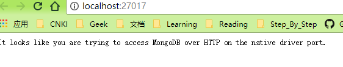

# MongoDB环境搭建

## CentOS 7 搭建Mongodb3.6(离线版)

### 1. 下载Mongodb3.6 

```bash
mkdir /software
wget https://fastdl.mongodb.org/linux/mongodb-linux-x86_64-rhel70-3.6.5.tgz
```

### 2. 安装Mongodb

```bash
tar -zxvf mongodb-linux-x86_64-rhel70-3.6.5.tgz
mv mongodb-linux-x86_64-rhel70-3.6.5 /usr/local/mongodb
```

### 3. 创建目录(数据目录, 日志目录, pid文件目录)

```bash
mkdir -p /usr/local/mongodb/data
mkdir -p /usr/local/mongodb/logs
mkdir -p /usr/local/mongodb/run
```

### 4. 添加环境变量

在/etc/profile中添加一下配置

```bash
export MONGODB_HOME=/usr/local/mongodb
export PATH=$MONGODB_HOME/bin:$PATH
```

然后

```bash
source /etc/profile
```

使配置文件生效

### 5. 创建配置文件

```bash
vi /usr/local/mongdb/mongod.conf
```

添加一下配置

```bash
systemLog:
    destination: file
    path: /usr/local/mongodb/logs/mongodb.log
storage:
    dbPath: /usr/local/mongodb/data
processManagement:
    fork: true
    pidFilePath: /usr/local/mongodb/logs/mongod.pid
net:
    bindIp: 0.0.0.0
```

### 6. 两种启动mongodb的方式

#### 从配置文件启动

```bash
mongod --config /usr/local/monodb/mongod.conf
```

如下图则表示启动成功

#### 从命令行启动

```bash
mongod --fork --dbpath /usr/local/mongodb/data --logpath /usr/local/mongodb/logs/mongod.log
```

### 7. 其他mongodb的命令

```bash
# 关闭mongodb
mongod --shutdown --dbpath /usr/local/mongodb/data/
# 连接mongodb 客户端
./mongo
```

## win10下搭建Mongodb3.6

### 1. 下载mongodb, [下载地址](https://www.mongodb.com/download-center), 然后一步步安装

###2. 配置

新建目录

* db目录: D:\MongoDB\data\db
* 日志目录: D:\MongoDB\data\log

### 3. 命令行下运行Mongodb

mongod.exe --dbpath D:\MongoDB\data\db启动成功后可以访问 <http://localhost:27017/>如果显示表示Mongodb已成功启动.

### 4. 配置mongodb服务

在Mongodb安装路径下创建一个配置文件mongod.cfg, 填上之前创建好的db和log路径, log需要指定一个文件名

```yml
systemLog:
    destination: file
    path: D:\MongoDB\data\log\mongod.log
storage:
    dbPath: D:\MongoDB\data\db

```

然后运行

```bash
# 配置文件的路径需要时绝对路径
mongod.exe --config "C:\mongodb\mongod.cfg" --install
```

移除mongodb服务

```bash
Mongod.exe --remove
```

