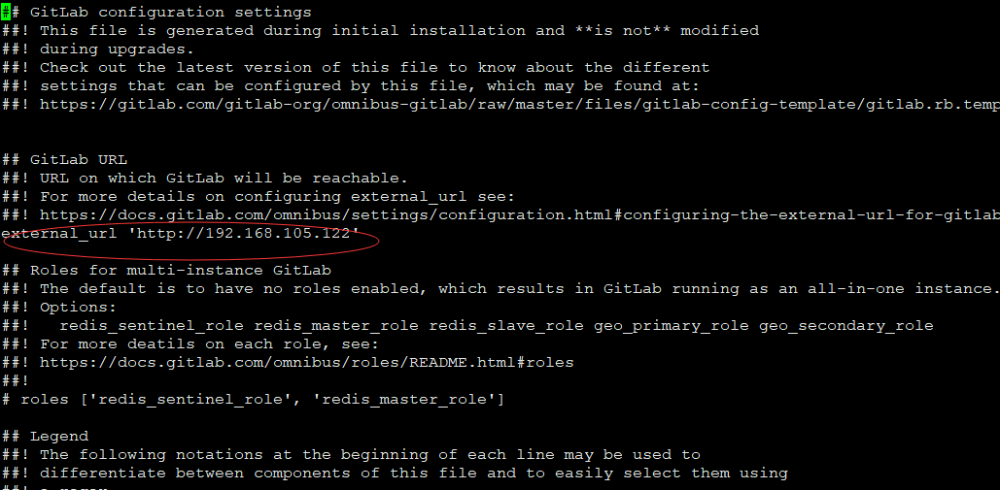
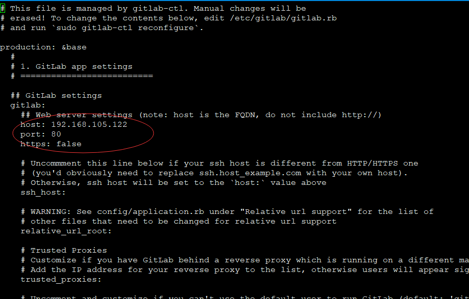

# 在CentOS 7中安装配置GitLab


 记录在CentOS下安装配置GitLab的过程.

## 安装GitLab

安装环境: CentOS 7

### 安装GitLab所需要的依赖

```bash
sudo yum install -y curl policycoreutils-python openssh-server
sudo systemctl enable sshd
sudo systemctl start sshd

sudo firewall-cmd --permanent --add-service=http
sudo systemctl reload firewalld

sudo yum install postfix
sudo systemctl enable postfix
sudo systemctl start postfix
```

### 添加GitLab包服务器安装包

```bash
curl https://packages.gitlab.com/install/repositories/gitlab/gitlab-ee/script.rpm.sh | sudo bash
sudo yum install gitlab-ce
```

这里也可以使用国内的一些镜像 例如[清华的镜像](https://mirror.tuna.tsinghua.edu.cn/help/gitlab-ce/)

首先, 新建 `/etc/yum.repos.d/gitlab-ce.repo`，内容为

```bash
[gitlab-ce]
name=Gitlab CE Repository
baseurl=https://mirrors.tuna.tsinghua.edu.cn/gitlab-ce/yum/el$releasever/
gpgcheck=0
enabled=1
```

再执行

```bash
sudo yum makecache
sudo yum install gitlab-ce
```

执行安装的过程有点慢, 需要稍微耐心等待一下.

## 配置GitLab

### 修改/etc/gitlab/gitlab.rb文件

执行如下命令

```bash
sudo vi /etc/gitlab/gitlab.rb
```

找到文件中的external_url, 修改成部署机器的IP地址



### 修改/var/opt/gitlab/gitlab-rails/etc/gitlab.yml文件

执行命令

```bash
sudo vi /var/opt/gitlab/gitlab-rails/etc/gitlab.yml
```

然后找到文件中的host, 和gitlab.rb一样, 修改成本机IP



如果没有找到gitlab.yml文件, 需要执行 `gitlab-ctl reconfigure` 命令, 之后再去执行路径下找gitlab.yml文件

至此gitlab已经安装配置完成.  执行`gitlab-ctl reconfigure` 然后访问之前配置的http:ip即可.

> 注: 安装完成后访问页面有一定概率出现 502 错误，刷新浏览器或者再次更新配置即可.

## GitLab 备份

### 创建备份

```bash
gitlab-rake gitlab:backup:create
```

上述命令会在`/var/opt/gitlab/backups/`路径下创建一个名称类似`1516330234_2018_01_19_version_gitlab_backup.tar`的备份文件. 这个文件包含GitLab所有数据(账号信息, 分组信息以及仓库等等).

### 从备份恢复


### 修改备份路径


##常用的Gitlab命令

```bash
# 重新应用gitlab的配置
sudo gitlab-ctl reconfigure
# 重启gitlab服务
sudo gitlab-ctl restart
# 查看gitlab运行状态
sudo gitlab-ctl status
# 停止gitlab服务
sudo gitlab-ctl stop
# 查看gitlab日志
sudo gitlab-ctl tail

# 查看版本
gitlab-rake gitlab:env:info
# 或者访问 http://192.168.105.122/help页面
```

## 安装中遇到的问题

1. CentOS报错: Could not resolve host: mirrorlist.centos.org; Unknown error

修改`/etc/sysconfig/network-scripts/ifcfg-eno*` 文件中的

```xml
ONBOOT=yes
```

然后重启网络服务`systemctl restart network` 即可.

2. 使用API创建账号 创建好的账号都需要再确认

> 在链接中添加`confirm=false` 即可.


## References

1. [GitLab官方文档](https://about.gitlab.com/installation/#centos-7)
2. [在CenterOS系统上安装GitLab并自定义域名访问GitLab管理页面](http://blog.csdn.net/ouyang_peng/article/details/72903221)

