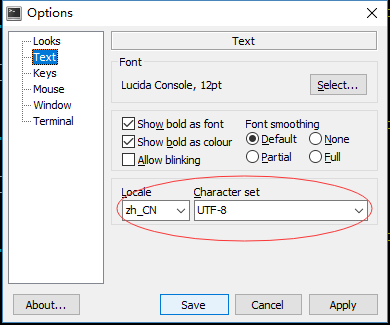
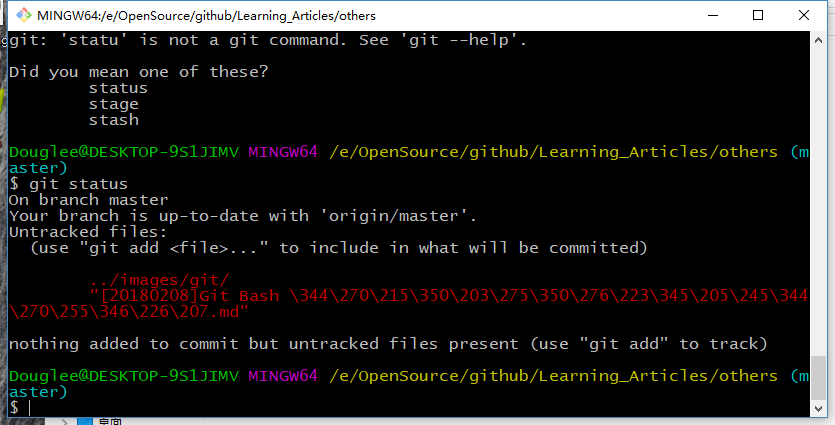

## 1. Git Bash 不能输入中文

解决方法:

1. 打开git bash, 在窗口处右键 -> Options;
2. 在Options中选择Text项,  Locale -> zh_CN, Character set -> UTF-8;
3. 重启git bash 即可




## 2. Git Bash 显示中文异常

异常如下图:




解决方法:

只要一行配置就可以搞定

```bash
git config --global core.quotepath false
```

正常显示的效果如下:

