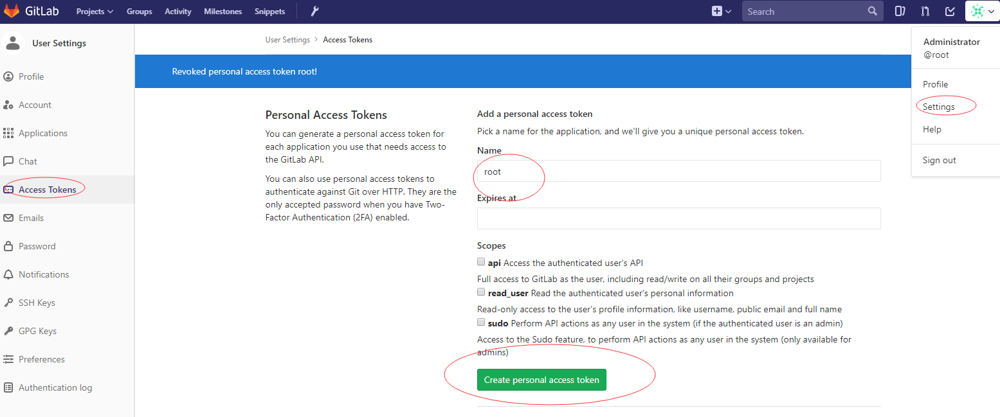

# 使用Python批量添加GitLab账号

## 前言

GitLab中通过界面添加用户只能一个个手动添加, 太麻烦, 可以通过调用GItLab提供的API的方式批量添加用户

##  API

使用API之前首先需要获取一个`Access Tokens`, 如下图



GitLab提供的API列表可以参考[https://docs.gitlab.com/ce/api/README.html](https://docs.gitlab.com/ce/api/README.html). 其中与用户账号有关的接口都在[https://docs.gitlab.com/ce/api/users.html](https://docs.gitlab.com/ce/api/users.html)

添加账号的接口为`http://192.168.105.122/api/v3/users`

## Python代码

使用Python批量添加用户

```python
import requests


url = "http://192.168.105.122/api/v3/users"
_token = 'gisFWh5yEW9aMAvfBukH'

user_info = [
    ('cnki1234', 'ldm@xx.com', 'ldm', '李道民'),
    ('cnki1234', 'jzy@xx.com', 'jzy', '姜占宇'),
    ('cnki1234', 'lyl@xx.com', 'lyl', '吕友良'),
    ('cnki1234', 'dh@xx.com', 'dh', '丁豪'),
    ('cnki1234', 'ww@xx.com', 'ww', '王稳'),
    ('cnki1234', 'yw@xx.com', 'yw', '杨文'),
    ('cnki1234', 'clf@xx.com', 'clf', '迟乐飞'),
    ('cnki1234', 'lmy@xx.com', 'lmy', '刘铭宇'),
    ('cnki1234', 'jlb@xx.com', 'jlb', '贾龙斌'),
    ('cnki1234', 'zcl@xx.com', 'zcl', '张采灵'),
    ('cnki1234', 'ly@xx.com', 'ly', '刘云'),
    ('cnki1234', 'glx@xx.com', 'glx', '高立新'),
    ('cnki1234', 'zx@xx.com', 'zx', '张旭'),
]


def create_user(item):
    payload = "password=%s&email=%s&username=%s&name=%s&confirm=false&"
    req = (payload % item) + "private_token=" + _token
    response = requests.post(url, data=req.encode('utf-8'))
    print(response.text)


if __name__ == '__main__':
    for item in user_info:
        create_user(item)

```


