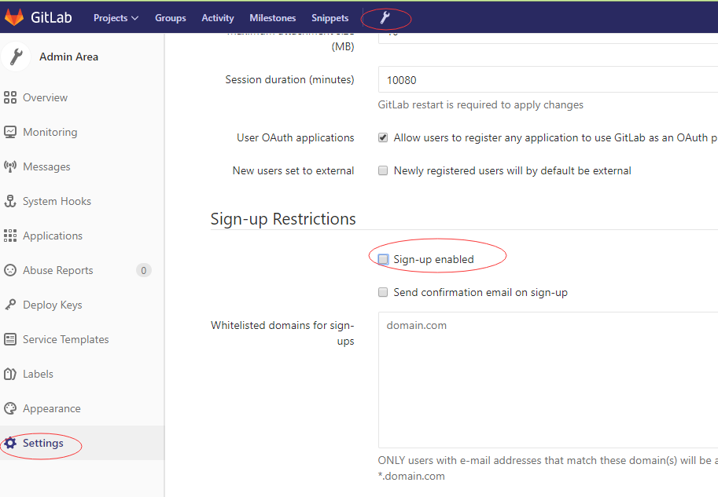

# GitLab几处配置

## 重置修改root密码

GitLab中root的默认密码是`5iveL!fe` , 如果要修改root密码话, 可以通过执行如下命令来修改

```bash
gitlab-rails console production
user=User.where(id:1).first
user.password='12345678'
user.password_confirmation='12345678'
user.save!
```

## 关闭GitLab注册功能

root账号进入gitlab中, `Admin area` => settings => 取消Signup enabled, 如下图所示.




## 设置只保留最近7天的备份

修改/etc/gitlab/gitlab.rb文件中的如下配置

```bash
gitlab_rails['backup_keep_time'] = 604800
```

然后重新`gitlab-ctl reconfigure`.

## GitLab的定时备份策略

### GitLab服务器上定时备份, 并且设置为只保存7天的数据

### 要备份的远程Windows服务器上新建bat任务